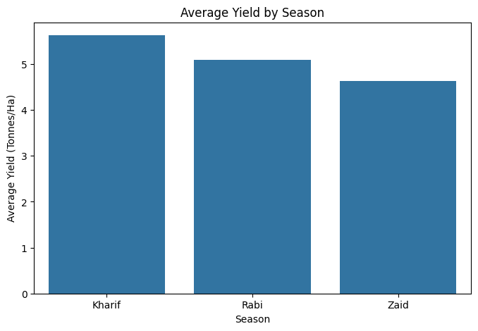
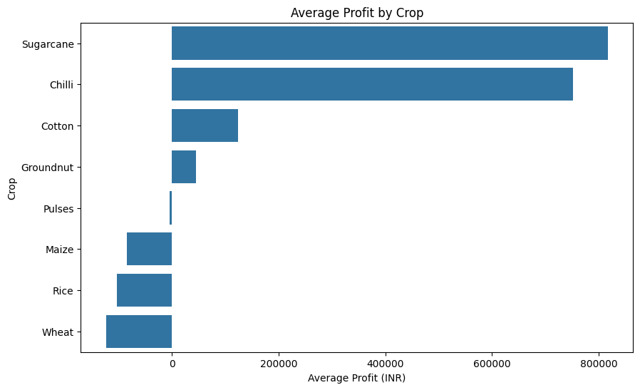
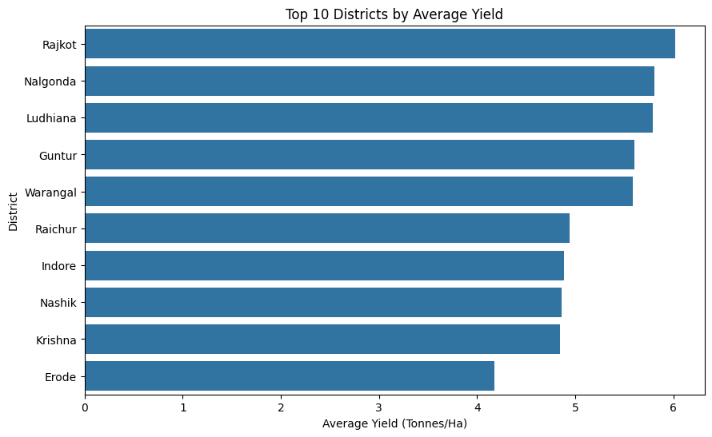

# Seasonal Agriculture Performance Analysis

## Project Overview

Seasonal Agriculture Performance Analysis is a data analytics project that examines agricultural performance across different seasons, crops, regions, irrigation methods, environmental conditions, resource usage, and economic outcomes.

The project uses Exploratory Data Analysis (EDA), statistical analysis, and data visualization to identify seasonal patterns, relationships, variations, and unusual observations.

## Objectives

- Analyze agricultural performance across different seasons.
- Compare crop and regional performance.
- Analyze irrigation and water usage.
- Study environmental and agricultural relationships.
- Evaluate revenue, cost, and profitability.
- Identify unusual patterns and outliers.
- Generate data-driven insights and recommendations.

## Dataset

- Records: 4,000
- Attributes: 28
- Seasons: Kharif, Rabi, Zaid
- Multiple crops, states, districts, and irrigation methods.

## Technologies Used

- Python
- Pandas
- NumPy
- Matplotlib
- Seaborn
- Google-collab

## Analysis Performed

1. Data Understanding
2. Data Cleaning
3. Exploratory Data Analysis
4. Seasonal Performance Analysis
5. Crop Performance Analysis
6. Irrigation and Water Efficiency Analysis
7. Regional Analysis
8. Economic Analysis
9. Correlation Analysis
10. Statistical Analysis
11. Outlier Analysis
12. Insights and Recommendations

## Key Findings

- Kharif showed the highest average yield and average profit in the dataset.
- Sugarcane showed the highest average yield and strong economic performance.
- Chilli also demonstrated strong profitability.
- Drip irrigation recorded high average yield and profitability.
- Rainfed farming showed high water efficiency.
- Yield and water efficiency showed a strong positive relationship.
- Considerable variation was observed in profitability across crops and farms.

## 📊 Project Visualizations

### Seasonal Performance


### Crop Profitability


### Regional Performance


## Future Scope

- Crop yield prediction using machine learning.
- Profitability prediction.
- Real-time weather and market-price integration.
- Crop recommendation systems.
- Interactive dashboards using Power BI or Streamlit.
- Disease and pest risk prediction.

## Project Structure

```text
Seasonal-Agriculture-Performance-Analysis/
│
├── 📁 data
│   ├── 📁 raw
│   │   └── seasonal_agriculture_performance_dataset.csv
│   │
│   └── 📁 cleaned
│       └── cleaned_dataset.csv
│
├── 📁 images
│   ├── average_yield_by_season.png
│   ├── average_profit_by_crop.png
│   ├── top_10_district_average_yield.png  
│
├── 📓 01_Data_review_&_cleaning.ipynb
├── 📓 02_Analysis.ipynb
├── 📄 README.md
└── 📄 requirements.txt
